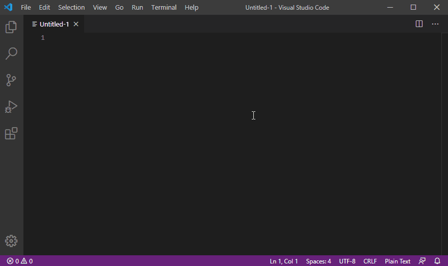

# nicegaugetables README

This extension is helping to create and maintain tables.
A table is defined by columns separated by the | character. It can have separator lines where the content of each column is a series of - characters.

## Features

Command: `Format Gauge Table`

Properly format the table surrounding the cursor position. It makes all columns of the same width on all lines and add missing columns.

Command: `Create Gauge Table`

Creates a table by asking for the number of rows and columns. It automatically creates a header row followed by a separator row.

## Future Features

* Delete columns
* Delete a full table
* Adding columns and rows to an existing table
* Interactive WebView panel to manage tables

## Extension Settings

Include if your extension adds any VS Code settings through the `contributes.configuration` extension point.

For example:

This extension contributes the following settings:

* `myExtension.enable`: enable/disable this extension
* `myExtension.thing`: set to `blah` to do something

## Known Issues

Calling out known issues can help limit users opening duplicate issues against your extension.

## Release Notes

Users appreciate release notes as you update your extension.

### 1.0.0

Initial release of ...

### 1.0.1

Fixed issue #.

### 1.1.0

Added features X, Y, and Z.
